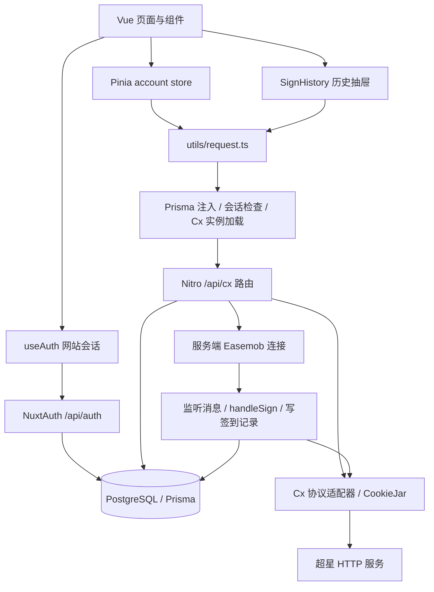
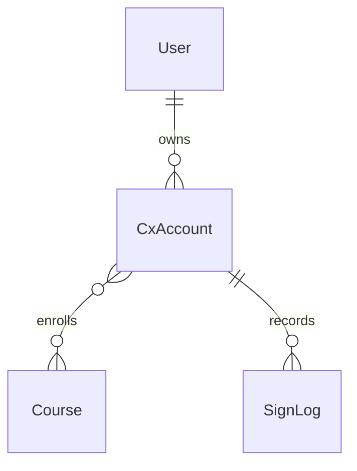

# 项目架构与前端改写准备

核查日期：2026-09-15；源码基线：`1aacb32`；项目版本：`0.5.2`。

本文基于当前源码及已安装认证依赖的静态检查。没有运行服务、读取真实凭据或数据库、调用超星服务、执行签到、构建或部署；“存在实现”不表示“线上可用”。本轮仅新增文档。

配套文档：[前端接口契约](FRONTEND_API.md)、[机器可读接口目录](frontend-api.inventory.json)。

## 1. 总体架构

项目是 Nuxt 3 全栈单体应用，前端 Vue 页面和服务端 Nitro API 同仓、同源运行。业务请求主要集中在 `stores/account.ts`；认证和历史记录有独立调用入口。

浏览器没有项目自建 WebSocket 或 SSE 订阅。`ws`、Easemob 的连接运行在服务端；历史记录在打开抽屉时查询，不会自动实时推送到前端。

## 2. 技术与目录

| 层 | 当前实现 | 关键位置 |
| --- | --- | --- |
| 页面与路由 | Nuxt `3.14.1592`、Vue SFC、文件路由、默认 SSR、页面 keepalive | `pages/`、`layouts/`、`app.vue` |
| UI | Naive UI、UnoCSS、SCSS、Nuxt Icon、VueUse | `components/`、`unocss.config.ts`、`assets/css/` |
| 主题 | `@nuxtjs/color-mode`、Naive UI provider，主色在三处配置 | `app.vue`、`unocss.config.ts`、`assets/css/main.css` |
| 状态 | Pinia account/log store；局部 ref 管理弹窗、请求状态 | `stores/` |
| HTTP | `$fetch.create`，错误提示耦合 Naive UI | `utils/request.ts` |
| 网站认证 | `@sidebase/nuxt-auth 0.9.4` + `next-auth 4.21.1` Credentials | `server/api/auth/` |
| API | Nitro/H3 文件路由；手写 JSON 返回包装 | `server/api/`、`server/utils/index.ts` |
| 数据 | Prisma 5、PostgreSQL | `prisma/schema.prisma`、`server/utils/db.ts` |
| 超星协议 | got、tough-cookie、cheerio；HTML/JSON 解析 | `server/protocol/cx/` |
| 后台监听 | Easemob Web SDK、JSDOM、ws、进程内 Map | `server/protocol/easemob/`、`server/utils/monitor.ts` |
| 帮助内容 | Nuxt Content | `content/help.md`、`pages/help.vue` |
| 启动与部署 | pnpm、Nitro Node 产物、PM2 / Docker / GitHub Actions | `package.json`、`ecosystem.config.js`、`Dockerfile`、`.github/workflows/ci.yml` |

源码目录包含 6 个页面、18 个组件、2 个 store、3 个服务端中间件、18 个 API 文件。API 文件中有 16 个业务接口、1 个认证通配处理器、1 个空文件。

Nuxt 自动导入组件、Vue/Nuxt 工具及 store；许多文件没有显式 import。迁往其他框架时需显式替换 `useAuth`、`useLazyAsyncData`、`navigateTo`、`ClientOnly`、`useMessage` 等集成。

## 3. 页面与功能映射

全局认证中间件已开启。只有帮助页、`/404` 显式关闭认证；登录页只允许未登录访问。`/404` 是独立页面文件，不等于已实现全局错误页。

| 页面 | 组件与状态 | API / 操作 |
| --- | --- | --- |
| `/auth/login` | `LoginCard` 登录、注册两个页签 | `useAuth().signIn('credentials', …)`、`POST /api/auth/signUp` |
| `/` | `Hero`、`AccountList`、`AccountItem`、`Operation`、`Log` | 同步/添加/移除超星账号、单账号与批量签到、监听、设置、历史 |
| `/account/:uid` | 从 account store 查账号；`CourseList` 与活动弹窗 | 获取课程、活动列表、课程签到、活动签到 |
| `/profile` | `useAuth().data.user` | 已有会话数据，只读资料；没有资料更新接口 |
| `/help` | page layout、`ContentDoc` | Markdown 内容，无自定义业务 API |
| `/404` | Naive UI Result | 返回上一页或首页 |

全局 Header 包含帮助入口、明暗主题切换、`UserButton`；后者提供资料和网站退出登录。默认布局包含 Header/Footer，`app.vue` 提供配置、消息、加载指示器。

### 首页组件职责

- `AccountList`：挂载时同步账号、列表选择、添加账号入口。
- `AccountLoginModal.client`：手机号和密码表单，经 store 登录超星；网站账号最多绑定 6 个超星账号的限制在服务端。
- `AccountItem`：账号卡片、移除确认、单账号签到、监听切换、历史及设置弹窗。
- `Operation`：全选、多账号并发操作；没有后端批量接口，是前端逐账号 `Promise.allSettled`。
- `QrCodeSignModal.client`：摄像头、图片选择/拖入、本地识别、粘贴链接、二维码预览；图片不上传到项目后端。
- `CodeOrGestureSignModal.client`：收集签到码或手势轨迹；由父组件携带活动上下文提交。
- `SettingModal.client`：延迟、地址/坐标、允许签到类型。照片上传和设置中的监听开关没有启用。
- `SignHistory`：打开时请求本站数据库记录；与 `Log` 的浏览器操作日志不同。
- `CourseList`：用户手动刷新课程，展示课程活动，触发签到。

## 4. 数据与状态归属

| 数据 | 持有者 | 说明 |
| --- | --- | --- |
| 网站身份 | NextAuth 会话 + User 表 | 邮箱/密码登录；会话扩展 `uid` 为本站 User.id，`role` 通常为空，schema 未定义 role |
| 超星身份 | CxAccount 表 + 服务端 Cx/CookieJar | `uid` 是超星用户 ID，与网站会话 uid 不同 |
| 课程 | Course 表、Cx.courseList、前端账号 courses | 数据库主键是 `${courseId}_${classId}`；不可仅按 courseId 视为唯一 |
| 设置 | CxAccount.setting、Cx.setting、前端账号 setting | 三者不是自动同步的；更新 API 只更新数据库 |
| 自动监听连接 | `IMConnectionMap` | 进程内运行态；持久化 `setting.monitor` 不等于连接健康状态 |
| 签到记录 | SignLog 表 | 本站请求结果；不能作为超星完整官方记录 |
| 选中账号/弹窗/加载中 | Pinia 与组件 ref | UI 状态，无后端对应字段 |
| 操作日志 | `useLocalStorage('log')` | 仅浏览器；清空不会删除服务端历史 |

`User` 存储 name/email/password/image；`CxAccount` 关联网站 User，存储超星登录信息、JSON info/cookies/setting；`SignLog` 包含活动名/ID、类型、模式、结果、时间和账号 ID。删除 CxAccount 会级联删除其 SignLog。

account store 使用 `skipHydrate`，watch 会写入 `localStorage.accounts`，但源码没有相应恢复读取，也没有 deep watch。同步返回不会补齐 `selected`，登录时才设置 `selected: true`。新前端应显式定义刷新后的选择状态，并清理网站退出后的账号缓存。

## 5. 关键业务链路

1. **网站登录**：邮箱/密码 → NextAuth Credentials → 查询 User → JWT 会话 Cookie → `/api/cx/**` 检查会话。
2. **绑定超星账号**：网站会话 → 超星手机号/密码登录 → 保存账号、Cookie、默认设置 → 返回账号数据。
3. **账号同步**：按网站用户过滤查询；超过 7 天的账号会尝试服务端重新登录并更新数据库。因此这个 GET 具有副作用，且当前响应仍使用更新前取出的数组。
4. **课程查询**：超星课程 HTML → 解析课程列表 → upsert 风格的批量创建/关联更新 → 返回列表。不是单纯读缓存。
5. **手动签到**：前端传账号及活动上下文 → Cx 获取/校验活动 → 预签到 → 按类型执行 → 部分路由保存记录 → 返回结果。
6. **需要额外输入的签到**：一键结果中的二维码/手势/签到码当前会先返回失败文本，UI 再弹窗收集输入；现有批量逻辑只取首账号的首个匹配活动，不能照搬为完整任务队列。
7. **监听**：服务端取 WebIM 信息 → 建立 Easemob 连接 → 消息触发 `handleMessage` → 延迟 → 签到 → 写数据库。重启恢复由 `im.initConnect` 控制，默认 false，PM2 配置显式启用。

普通签到和拍照签到同为 `otherId=0`，照片由 `ifPhoto=1` 区分。当前拍照流程从服务端云盘适配器取 `0.png/0.jpg`，没有照片上传 API；该适配器存在硬编码上游参数，需另行核查，文档不复制其值。

## 6. 前端改写前的具体问题

以下是源码证据，不是已复现的线上测试结果。

| 优先级 | 发现与影响 | 证据 |
| --- | --- | --- |
| 高 | `/api/cx` 只验证有网站会话；通用 Cx 中间件按传入 uid 取账号，未检查所属 userId。账号列表的过滤不能替代后续操作的授权 | `server/middleware/1.auth.ts`、`2.cx.ts` |
| 高 | 注册返回完整 User，含 password；超星登录响应仍含 cookies；账号列表只删除顶层 password，info 来源可包含 password。DTO 必须收窄，不能整包持久化到浏览器 | `server/api/auth/signUp.post.ts`、`server/api/cx/login.post.ts`、`accounts/index.get.ts`、`server/protocol/cx/index.ts` |
| 高 | 网站密码保存与查询未哈希；超星账号 upsert 会更新 userId，既有绑定的归属规则需明确 | `server/api/auth/[...].ts`、`signUp.post.ts`、`server/api/cx/login.post.ts` |
| 高 | 课程签到已执行外部操作后，写日志含 schema 不存在的 `isSigned`，且缺少必填 activityName/type/mode，可能导致返回错误但签到已发生；不能自动重试 | `server/api/cx/courses/[cid]/sign.post.ts` 对照 `prisma/schema.prisma` |
| 高 | 批量手势/签到码传 3 参数而 store 定义需要 4 参数，参数错位；批量二维码缺 courseId；allSettled 不检查首项是否 fulfilled | `components/Operation.vue:51`、`:98`、`:119`、`stores/account.ts:142` |
| 中 | 单账号直接扫码依赖尚未设定的 doingActivity.course，可能空引用；二维码链接正则对参数顺序/末尾要求脆弱 | `components/AccountItem.vue:75`、`stores/account.ts:176` |
| 中 | 直接刷新 `/account/:uid` 不加载账号；依赖首页先同步，store 为空时详情缺失 | `pages/account/[uid].vue`、`components/AccountList.vue:24` |
| 中 | monitor/unmonitor 响应是 `data.data.isOpened`；卡片用初始化 ref 及调用后本地赋值，未持续同步服务端状态 | `server/api/cx/accounts/[uid]/monitor.post.ts`、`components/AccountItem.vue` |
| 中 | update_setting 整体替换 JSON，未更新 Cx.setting；设置表单直接引用 props，未保存的修改已影响本地账号 | `server/api/cx/accounts/[uid]/update_setting.post.ts`、`components/SettingModal.client.vue:28` |
| 中 | 课程/单活动签到不传账号 setting，过滤和位置配置与一键签到不一致；单活动路由不写 SignLog | `server/protocol/cx/index.ts:432`、`:460`、`server/api/cx/courses/[cid]/activities/[aid]/sign.post.ts` |
| 中 | CXMap 登录按 username 存，中间件/退出按 uid 查删；监听关闭回调递归注册监听，实际恢复和清理行为待联调 | `server/api/cx/login.post.ts:29`、`server/middleware/2.cx.ts`、`server/utils/monitor.ts` |
| 中 | 认证错误与业务错误结构不同；绝大多数 store 调用不判断业务 code；失败结果仍可能 HTTP 200 | `utils/request.ts`、`server/utils/index.ts`、`stores/account.ts` |
| 低 | 空课程详情接口；忘记密码路由缺失；“记住我”未绑定；PWA 组件被引用但本地未找到对应实现/启用模块 | `server/api/cx/courses/[cid].get.ts`、`LoginCard.vue`、`app.vue`、`layouts/default.vue`、`nuxt.config.ts` |
| 低 | 类型定义有 `id: stringÏ`、`courseId: numebr`，课程签到 Body 的 Course 没有导入；已有声明不能直接作为新契约 | `types/account.d.ts`、`sign_by_qrcode.post.ts`、`courses/[cid]/sign.post.ts` |

这些后端问题应作为独立修复范围确认，文档没有修改它们。前端应独立记录“请求成功”和“签到结果”，对已提交但结果未知的请求提示查询历史，避免直接自动重试。

## 7. 改写的拆分建议

模型建议：后续改写涉及认证、跨组件状态及接口兼容，按 C 类/L3 能力开展；以模块为单位保持可验证范围。

技术栈和视觉方向尚未指定，以下只确定边界，不预先决定 Vue/React 或组件库：

1. 建立 `auth`、`accounts`、`courses`、`signing`、`settings`、`history` 六组 API 服务；界面提示与底层请求分离。
2. 建立前端专用 DTO：不导入服务端路由类型，不接收/持久化 password、cookies；ID 用字符串管理，适配层明确转换，避免严格比较差异。
3. 建立统一结果类型：HTTP 错误、业务 code 错误、签到 result 错误分别处理；兼容监听双层 data。
4. 页面独立加载：会话确认 → 账号同步 → 匹配 uid → 课程展示；处理未找到账号、无课程、加载失败与重试。
5. 为每个账号/课程/活动维护请求状态，批量结果逐项展示；额外输入流程保留各自 uid/courseId/activityId 上下文。
6. 设置使用深拷贝草稿，保存成功后更新 store；取消和重置不污染已保存对象。
7. 保留摄像头、本地图片识别、粘贴链接三个入口；相机关闭随弹窗生命周期执行；不把 emit 完成当作网络请求完成。
8. 先用脱敏固定数据验证新界面，再做有明确账号授权的真实联调。

若保留 Nuxt，可继续使用现有 useAuth 会话适配。若拆成独立前端，应先定同源反向代理还是跨源方案；`cors: true` 本身不能证明跨站 Cookie/CSRF/回调已兼容。不能静态导出前端后期待服务器监听随之迁移。

### 改写验收场景

- 登录失败/成功、会话过期、退出清理、注册业务错误。
- 直接访问/刷新账号详情、账号不存在、重新同步后的选择状态。
- 空课程/活动、失败重试、同 courseId 不同 classId。
- 单账号操作、批量部分失败、需要额外输入的多个活动、连续点击防重复。
- 设置取消/重置/保存失败，监听开启失败/关闭失败/后台断连后的状态展示。
- 历史与本地日志独立、空结果、请求失败、移动端抽屉布局。
- 扫码权限拒绝/无相机/图片识别/无效链接/关闭弹窗释放摄像头。

## 8. 运行与验证边界

`package.json` 提供 dev/build/start/preview/lint，但没有 test 脚本；现有 4 个 Vitest 文件是协议/IM 测试，读取环境账号并调用外部系统，不属于可直接运行的无副作用前端单测。

Docker 基础镜像声明 Node 18、CI 声明 Node 16；本地安装的 got 14.4.5 与 nuxt-auth 0.9.4 均声明 Node >=20。后续构建前需统一实际运行时，本文未升级依赖。Prisma 产物与 Docker 打包的一致性也需要部署阶段验证。

本轮验证范围：目录计数、调用入口、路由和参数交叉核对、认证本地实现检查、接口目录覆盖校验。没有把编译、运行或第三方服务行为描述为已验证。
